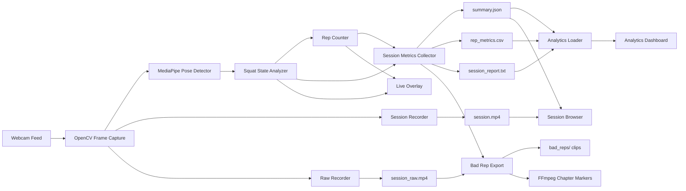
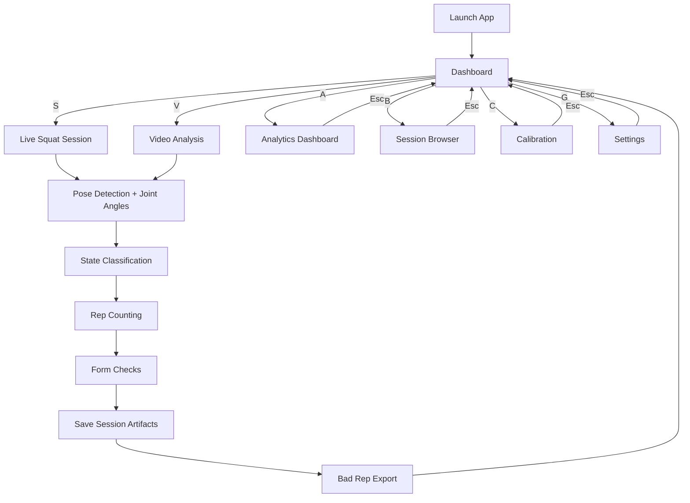
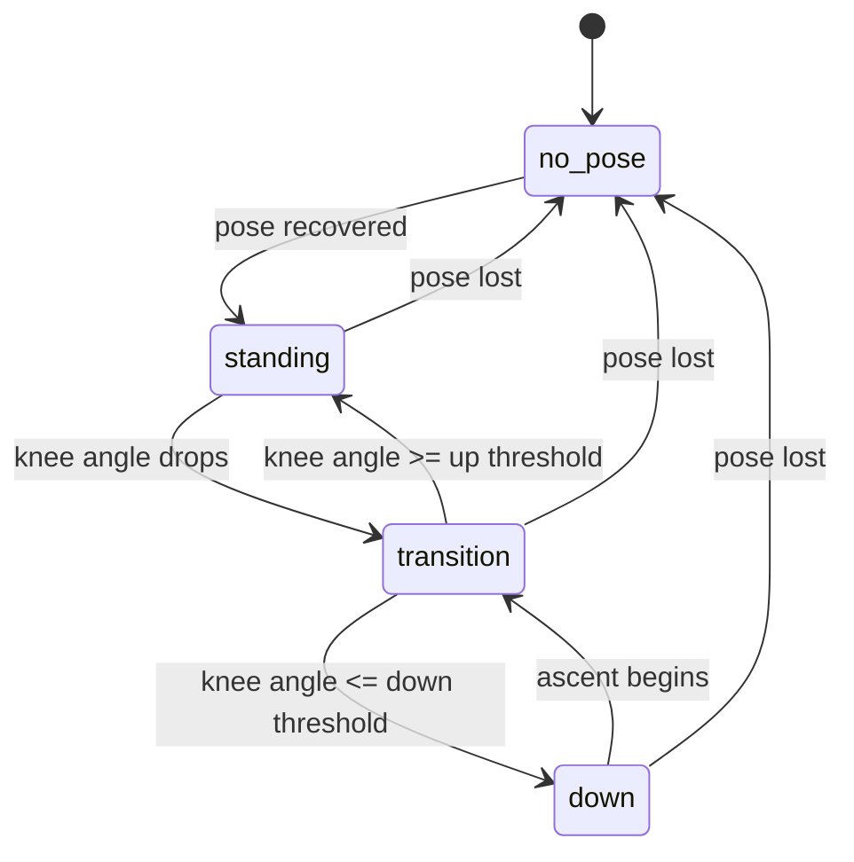
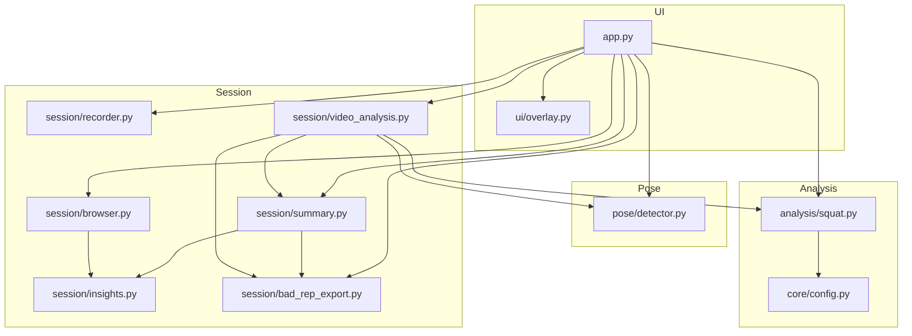

# GymGuardian Final Project Artifacts

## 1. Scope and Framing

GymGuardian is a desktop-based real-time squat monitoring and analytics system. The project scope is deliberately limited to one exercise so the final submission can demonstrate technical depth, explainable rules, and defensible evaluation.

Current scope:

- squat analysis only
- single webcam input
- local processing and local storage only
- rule-based coaching signals on top of pose estimation

Out of scope for the final submission:

- multi-exercise coaching
- cloud sync or mobile deployment
- adaptive machine-learned thresholds
- medical or rehabilitation advice

## 2. System Architecture

## 3. Application Workflow

## 4. Squat State Transition Model

## 5. Module/Component View

## 6. Methodology Notes

### 6.1 Why MediaPipe and OpenCV

MediaPipe provides stable pose landmarks without requiring a custom training pipeline. OpenCV handles camera capture, rendering, recording, and desktop display. This combination keeps the prototype lightweight and practical for local real-time use.

### 6.2 Joint-Angle Computation

The current system uses 2D landmark geometry:

- knee angle: hip -> knee -> ankle
- ankle angle: knee -> ankle -> foot index
- torso lean angle: shoulder -> hip relative to the vertical image axis

The torso metric is a simple posture proxy. A larger torso angle indicates more forward lean.

### 6.3 Threshold Strategy

The app uses explicit thresholds stored in `src/core/config.py`.

- `up_knee_angle`: identifies the standing state
- `down_knee_angle`: identifies the low squat state
- `rep_bottom_knee_angle`: confirms the bottom portion of a valid cycle
- `shallow_knee_angle`: flags shallow squats as the main bad-rep condition
- `ankle_control_angle`: flags limited ankle bend / control as an advisory issue
- `torso_lean_angle`: flags excessive forward lean as an advisory issue

These thresholds are intentionally simple and interpretable. They support explanation during evaluation and can be tuned from observed test evidence.

### 6.4 Smoothing and State Robustness

The squat analyzer uses a short moving average over recent joint-angle values. The goal is to reduce frame-to-frame noise without introducing a heavy control system. The rep counter also requires:

- repeated standing frames before arming a new repetition
- repeated bottom frames before confirming a repetition start
- automatic cycle reset after several no-pose frames

### 6.5 Why a Rule-Based Layer

A rule-based analysis layer is appropriate for this final-year prototype because it is:

- computationally cheap
- explainable in the report and viva
- easy to validate against manual observations
- easier to debug than a custom trained classifier

The pose detector itself is model-based, but the movement-quality decisions remain hand-authored and inspectable.

## 7. Camera and Usage Assumptions

GymGuardian currently assumes:

- a single front-facing or near-front-facing camera
- stable indoor lighting
- full lower-body visibility during the squat
- moderate distance from the camera
- minimal occlusion of hips, knees, ankles, and feet

These assumptions should be stated explicitly in the report because they define the operating envelope of the prototype.

## 8. Legal, Ethical, and Professional Considerations

### 8.1 Privacy

The system processes webcam data locally. No cloud upload or remote storage is required by the current design. Users should still be informed that recorded videos and summaries are saved to disk.

### 8.2 Safety and Misuse

GymGuardian is not a medical device and should not be presented as clinical or professional coaching advice. It provides prototype-level feedback based on visible body geometry only.

### 8.3 Bias and Environmental Dependence

Pose-estimation quality depends on camera quality, clothing contrast, lighting, and viewpoint. This must be treated as a limitation rather than hidden behind generic accuracy claims.

### 8.4 Professional Responsibility

Recommendations shown by the analytics dashboard must remain conservative. The current wording avoids medical claims and focuses on movement consistency, squat depth, ankle control, and torso posture.

## 9. Security Notes

- no cloud transmission is used in the current prototype
- session evidence is stored locally in timestamped folders
- users are responsible for managing and deleting saved videos and summaries
- the application should only be run on trusted local machines because saved recordings may contain personal data

## 10. Future Work

Future work can extend the project after the squat pipeline is fully evaluated.

Potential next steps:

- support additional exercises after the squat workflow is stable
- add calibration routines for user height and camera distance
- add richer per-rep scoring instead of issue-only tagging
- investigate adaptive thresholds or hybrid rule/ML classification
